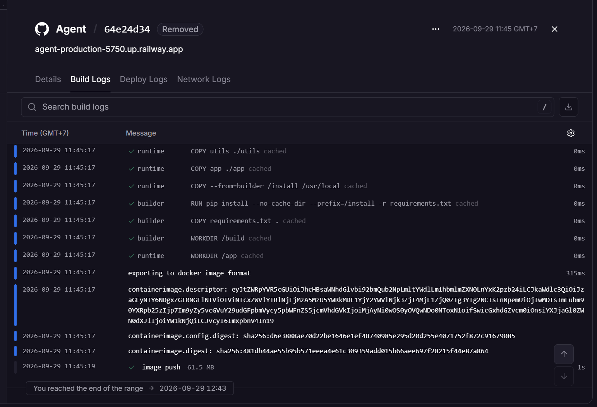
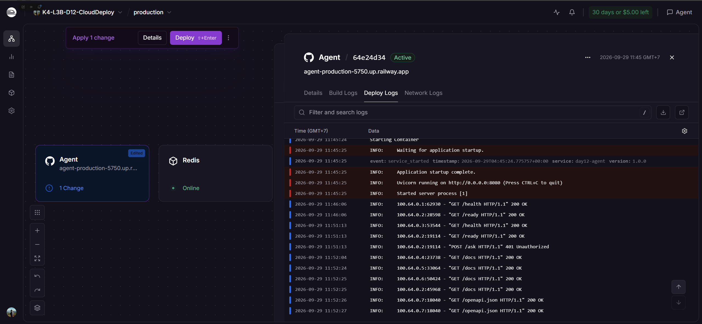

# Phiếu Phản Ánh — K4 Level 3B, Ngày 12

Họ và tên: Nguyễn Hồng Thái  Mã học viên: 2A202602894

### Câu 1 — Fail fast (CP1)

Nếu quên đặt `AGENT_API_KEY` trên Railway, app dừng ngay lúc khởi động và log báo thiếu cấu hình. Nếu dùng mặc định `changeme`, app vẫn chạy và người ngoài có thể đoán dùng khóa đó để gọi API.

### Câu 2 — Log cho máy đọc (CP1)

Log thật khi gọi `/ask` trên Railway:

```json
{"event":"ask_completed","level":"info","timestamp":"2026-09-29T03:31:57.854742+00:00","user_id":"cp5-test","tokens_in":3,"tokens_out":35,"cost_usd":0.00002145}
```

Có thể lọc các lần gọi theo `user_id` để điều tra người dùng cụ thể, và tổng hợp token/chi phí theo thời gian. `print("đã trả lời xong")` không có trường dữ liệu để truy vấn như vậy.

### Câu 3 — Kích thước image (CP2)

| Bản | Dung lượng |
|-----|-----------|
| 1 stage (bản đầu) | Chưa đo được bằng `docker images`: máy này không có Docker CLI |
| Multi-stage | Railway ghi nhận 64.5 MB dữ liệu image đẩy lên registry; đây là kích thước upload, không phải phép đo `docker images` |

Chưa có phép đo so sánh cùng một cách nên không kết luận phần chênh lệch bằng con số. Về cấu trúc, bản multi-stage chỉ chép thư viện đã cài và source vào image runtime; các file cài đặt/build và cache của giai đoạn builder không được chép sang.

### Câu 4 — Thứ tự lệnh trong Dockerfile (CP2)

Đổi `app/main.py` không làm đổi `requirements.txt`, nên bước cài package và các layer trước nó được dùng lại. Layer `COPY app ./app` phải chạy lại; các layer sau nó như `COPY utils` và tạo user cũng được dựng lại vì cache phụ thuộc layer trước. Nếu `COPY . .` đặt trước `pip install`, thay một file source cũng làm mất cache của bước cài package và phải cài lại dependency.

### Câu 5 — Vì sao không chạy bằng root (CP2)

Nếu process chạy bằng root, lỗ hổng cho phép chạy lệnh trong app có thể cho kẻ tấn công quyền root bên trong container; nếu khai thác thêm lỗi runtime/container hoặc mount được cấp quyền, họ có thể tìm đường sang host. `USER appuser` chạy process bằng UID 10001 nên lệnh sau khi khai thác không có quyền root trong container, giảm quyền và tác động của sự cố.

### Câu 6 — Cửa sổ trượt (CP3)

Có thể gửi 10 request ở những giây cuối của một phút, rồi thêm 10 request ngay đầu phút kế tiếp. Bộ đếm reset theo phút đồng hồ nên vẫn cho qua 20 request trong khoảng hai giây quanh mốc đổi phút.

### Câu 7 — Rate limit và cost guard (CP3)

Rate limit giới hạn số request trong 60 giây; cost guard giới hạn tổng tiền đã ghi nhận trong tháng UTC. Khi còn dưới 10 request/phút nhưng ngân sách tháng đã dùng hết, limiter cho qua còn cost guard trả 402. Ngược lại, khi ngân sách còn nhưng user gửi request thứ 11 trong một phút, rate limiter trả 429 trước khi kiểm tra cost guard.

### Câu 8 — `/health` khác `/ready` (CP4)

Khi Redis mất kết nối, nếu `/health` cũng kiểm tra Redis thì cả ba container trả lỗi liveness. Orchestrator hiểu nhầm process bị hỏng và lần lượt khởi động lại chúng; Redis vẫn mất nên các container mới lại lỗi, làm cả cụm chập chờn dù app process còn chạy. Tách `/ready` cho Redis và giữ `/health` nhẹ giúp load balancer ngừng gửi traffic vào instance chưa sẵn sàng mà không restart toàn cụm.

### Câu 9 — Stateless (CP4)

Hai request liên tiếp tới Railway với cùng `X-User-Id` trả `history_length` lần lượt là 0 rồi 2; Redis dùng chung nên lưu hai message của lượt đầu. Nếu lịch sử nằm trong dict, mỗi process sẽ có dict riêng: request sang instance chưa từng nhận user đó có thể lại thấy 0, còn instance khác thấy số khác. Restart process cũng làm mất dict.

### Câu 10 — Deploy thật (CP5)

Khi tạo Railway project, lần đầu tên dài theo tên repo bị từ chối với thông báo `Project names must be between 1 and 32 characters.` Mình đổi tên project thành `K4-L3B-D12-CloudDeploy` rồi tạo lại thành công. Build/deploy ứng dụng sau đó thành công; `/health` và `/ready` đều trả 200. Build Logs cho thấy image 61.5 MB được push thành công; deployment trong ảnh đã được thay thế bởi deployment mới hơn.




